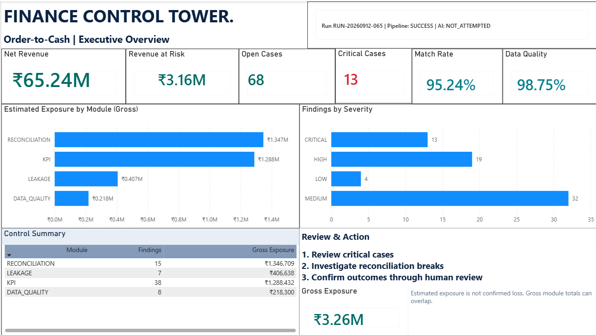
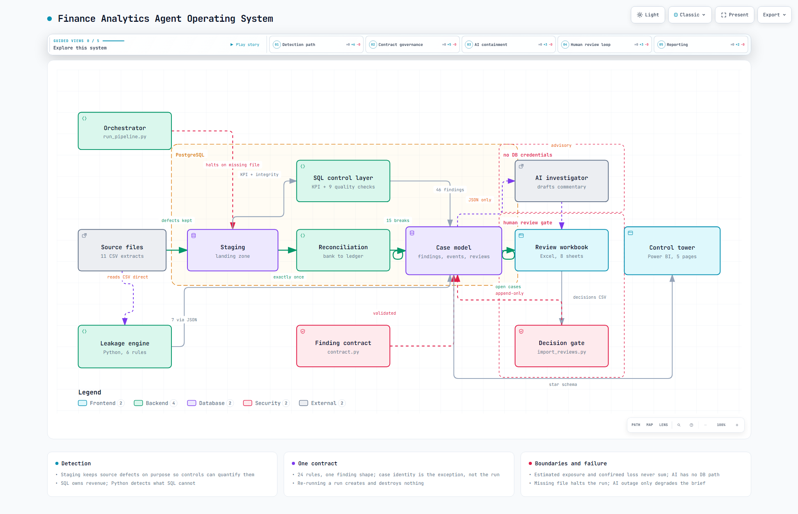
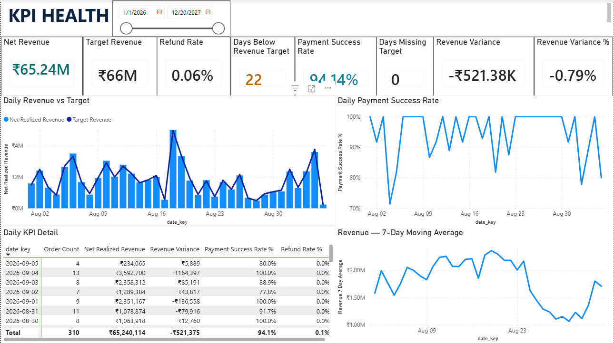
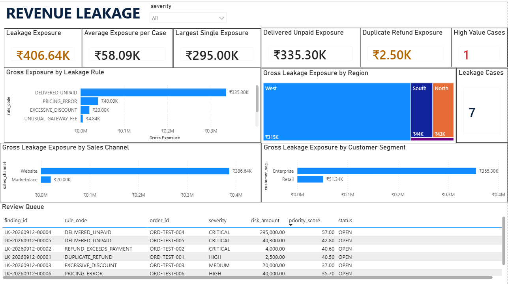
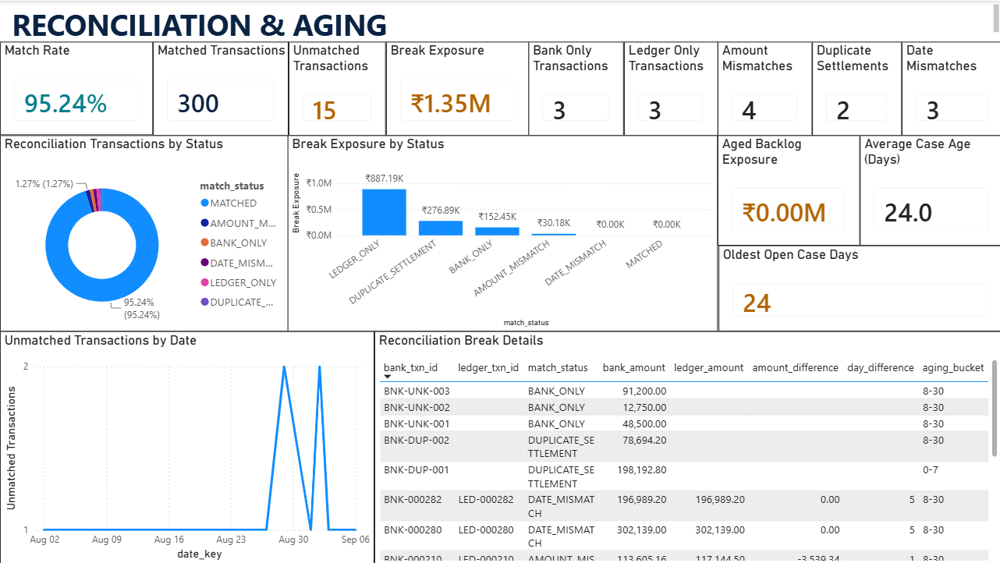
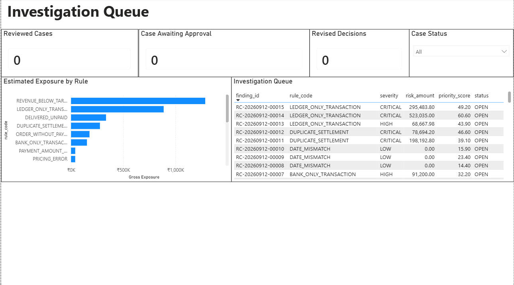
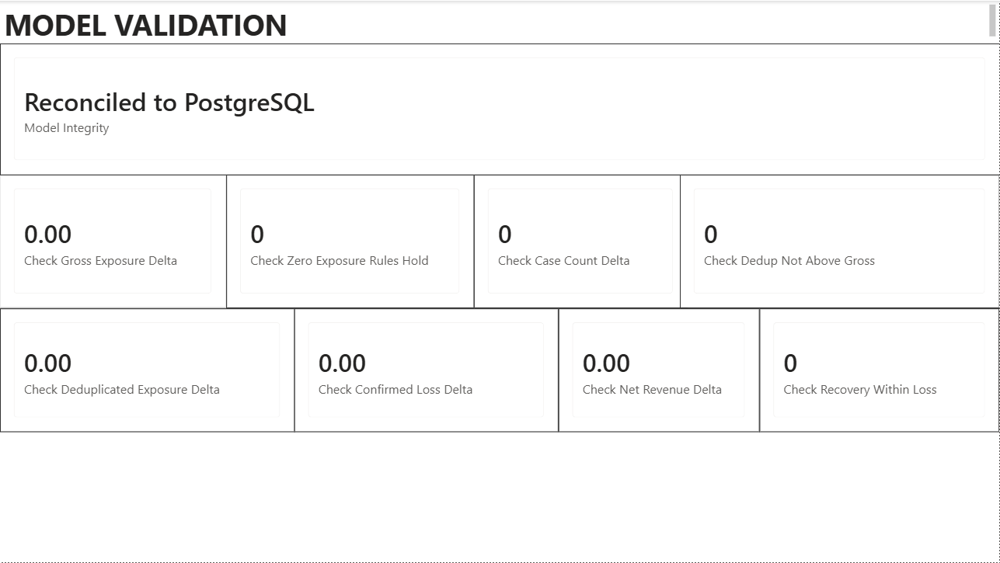
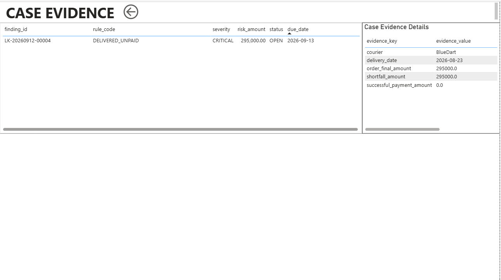

<div align="center">

# 🏦 Finance Control Tower

### Order-to-cash revenue assurance: find leaked money, prove it, and close the loop


**SQL controls · Python detection · evidence-restricted AI investigator · Excel human review · Power BI control tower**<br>
One auditable workflow behind a single command.

</div>

```bash
python src/run_pipeline.py
```



---

## 🎯 The problem

An online business sells, ships, collects payment, refunds, and settles with the bank.
Somewhere between **"order placed"** and **"cash in the bank"**, money leaks:

- 📦 Orders **delivered but never paid**
- 💸 Refunds **larger than the payment**, or **paid twice**
- 🏷️ Items sold **below the price list** or with wrong fees
- 🏦 Bank deposits and ledger entries that **don't match**: missing, duplicated, wrong amount, late
- 📉 Daily KPIs drifting from target with **nobody noticing**
- 🧹 Dirty source data (orphans, negatives, duplicate keys) **silently corrupting the numbers**

In most finance teams this is caught **late, manually, in spreadsheets**. When it is caught,
nobody can say how much money is really at risk, which cases matter first, or who confirmed what.
"AI for finance" usually makes this worse: a chatbot that sounds confident about numbers it never computed.

## 💡 How I solved it

I built a small **finance-control operating system**, not just a dashboard:

| Step | What happens | Built with |
|---|---|---|
| 1. **Land** | 11 source CSVs land in staging *with their defects preserved*, so controls can see them | Python, PostgreSQL |
| 2. **Detect** | Three independent detectors: **9 data-quality + KPI controls**, **6 revenue-leakage rules**, **bank ↔ ledger reconciliation (5 break types)** | SQL, Python |
| 3. **Unify** | Every finding follows one **shared contract** (24 rules) and lands in one case model: immutable findings, append-only reviews, idempotent across reruns | PostgreSQL triggers + constraints |
| 4. **Explain** | An AI investigator writes business-language commentary from a JSON file. It has **no database access at all** (enforced by an AST test) | LLM API, with a deterministic fallback |
| 5. **Review** | Finance reviewers decide in an 8-sheet Excel workbook. Decisions are validated **all-or-nothing** before going back to Postgres | openpyxl, validation gate |
| 6. **Report** | Power BI control tower on a star schema; a hidden validation page proves every tile ties to the database | Power BI, DAX |

> **Core principle: AI explains findings. It never decides them.** Financial truth is computed by
> deterministic SQL and Python, confirmed by a human, and recorded append-only.

### Results on the shipped dataset

| Metric | Value |
|---|---|
| Source rows staged | 2,312 |
| Findings raised | 68 across 4 modules (13 critical) |
| **Deduplicated exposure** | **₹3,156,724** (gross ₹3,260,079) |
| Reconciliation match rate | 95.24% |
| Data quality score | 98.75% |
| Pipeline runtime | ~1.5 s |
| Tests | 137 passing |

---

## 🏗️ Architecture



Interactive version (pan, zoom, search, guided views): download [`docs/architecture.html`](docs/architecture.html) and open it in a browser.
Generated with Archify from [`docs/architecture.json`](docs/architecture.json).

---

## 📊 Power BI dashboards

| | |
|---|---|
| **Executive Overview**<br> | **KPI Health**<br> |
| **Revenue Leakage**<br> | **Reconciliation & Aging**<br> |
| **Investigation Queue**<br> | **Model Validation**<br> |
| **Case Evidence**<br> | |

Design targets for each page are in [`docs/dashboard-design/`](docs/dashboard-design/).

---

## 🧠 Skills demonstrated

| Area | What this project shows |
|---|---|
| **SQL / PostgreSQL** | Star-schema reporting views, KPI definitions, reconciliation joins, CHECK constraints, immutability and append-only triggers |
| **Python** | ETL pipeline, rule engine, idempotent upserts, orchestration, CLI flags |
| **Data quality** | 9 controls, deliberately unconstrained staging, halt-on-missing-source policy |
| **Finance domain** | Order-to-cash, revenue leakage, bank ↔ ledger reconciliation, exposure vs confirmed loss, aging and SLA |
| **Data modeling** | Shared finding contract, case identity design, deduplicated exposure |
| **Responsible AI** | Structurally sandboxed LLM, PII-free prompts, graceful degradation on outage |
| **BI & visualization** | Power BI, DAX measures, 7-page control tower, reconciliation-to-source validation page |
| **Excel** | Reviewer workbook, validated CSV round-trip with no VBA |
| **Testing** | 137 pytest tests: unit, end-to-end, idempotency, failure paths, AST-level security checks |

---

## What it does

```
 CSV sources ──► staging (defects preserved) ──► control layer
                                                      │
      ┌───────────────────────────────┬────────────────┴───────────────┐
      ▼                               ▼                               ▼
 SQL controls                  Python leakage                 Reconciliation
 KPI variance                  6 rules                        bank ↔ ledger
 9 data-quality checks         exposure + evidence             5 break types
      └───────────────────────────────┴────────────────┬───────────────┘
                                                       ▼
                                          unified case model (Postgres)
                                          immutable findings
                                          append-only reviews
                                                       │
                        ┌──────────────────────────────┼────────────────────┐
                        ▼                              ▼                    ▼
               AI investigator              Excel review queue      Power BI tower
               (JSON in, prose out,         validated CSV round     7 pages, totals
                no DB access)               trip back to Postgres   tie to source
```

---

## Setup

Requires PostgreSQL 14+ and Python 3.11+.

```bash
pip install -r requirements.txt

# Create the database
psql -U postgres -c "CREATE DATABASE finance_capstone;"

# Optional: override the default connection / add an AI key
cp .env.example .env

# Generate the derived datasets (KPI targets, bank + ledger settlement)
python src/generate_settlement_data.py

# Run everything
python src/run_pipeline.py
```

Default DSN if `DATABASE_URL` is unset:
`host=127.0.0.1 port=5432 dbname=finance_capstone user=postgres password=admin`

**No AI key is needed.** Without one the pipeline runs end to end and the
executive brief falls back to a deterministic template. See
[Failure handling](#failure-handling).

### Useful flags

```bash
python src/run_pipeline.py --run-id RUN-20260912-001   # rerun a run (proves idempotency)
python src/run_pipeline.py --no-ai                     # demonstrate the outage path
python src/run_pipeline.py --skip-schema               # skip DDL when unchanged
python -m pytest tests/ -q                             # full suite
python src/contract.py                                 # contract self-check
```

---

## The finding contract

Everything hinges on one shared data contract, documented in
[`docs/finding_contract.md`](docs/finding_contract.md) and enforced by
[`src/contract.py`](src/contract.py) and [`config/contract.json`](config/contract.json).

Twenty-four rules across four modules all emit the same structure, so SQL,
Python and reconciliation findings land in one case model without the loader
knowing which produced them.

### Three decisions worth defending

**1. `risk_amount` is estimated exposure. It is never confirmed loss.**

They live in different tables and are never summed. `fact_findings.risk_amount`
is what a rule suspects; `fact_reviews.confirmed_loss` is what a person verified.
A database constraint blocks a detector from writing a confirmed loss at all, and
an end-to-end test asserts those columns do not exist on the findings table.

The payoff is the measure the whole system exists for — estimate against reality:

| Rule | Estimated | Confirmed loss |
|---|---:|---:|
| LEDGER_ONLY_TRANSACTION | ₹818,519 | ₹523,035 |
| DELIVERED_UNPAID | ₹295,000 | ₹295,000 |
| REVENUE_BELOW_TARGET | ₹110,725 | ₹0 *(false positive)* |

**2. Exposure is deduplicated before it is reported.**

One order can trip several rules, so `SUM(risk_amount)` counts the same money
more than once. Headline figures take the worst finding per order
(₹3,156,724 rather than ₹3,260,079). Gross appears only in rule-level
breakdowns, where the double count is expected and labelled.

**3. Some rules carry zero exposure on purpose.**

A settlement two days late is a control failure and an SLA input — but the money
arrived. `DATE_MISMATCH`, `DUPLICATE_PRIMARY_KEY` and the rate-gap KPI rules are
flagged `zero_exposure_by_design`, enforced by a CHECK constraint and a test.
Booking them as exposure would inflate "revenue at risk" with money that was
never lost.

### Case identity, and why it excludes `run_id`

A case is identified by **what the exception is** — `(rule_code, entity_type,
entity_id, evidence_hash)` — not by the run that noticed it.

This was originally built the other way, and the flaw showed up immediately on
the second run: exposure doubled to ₹6.5M, case count jumped to 136, and the
reviews recorded a moment earlier were stranded on an orphaned copy while fresh
`OPEN` duplicates appeared beside them.

Now a run that re-detects an unresolved problem updates the existing case,
advancing `times_seen` and `last_seen_run_id` while `run_id` preserves first
detection. That is what makes aging, SLA and backlog mean anything across runs —
and `tests/test_end_to_end.py::test_human_decisions_survive_a_later_run` is the
regression test for it.

`evidence_hash` deliberately excludes `detected_at`: a rerun produces a new
timestamp for the same exception, and hashing it would defeat idempotency
entirely.

---

## What the AI can and cannot do

Allowed: `draft_commentary`, `recommend_next_check`, `request_review`,
`flag_missing_evidence`, `group_related_cases`, `prepare_management_summary`.

Its powerlessness is **structural, not instructed**. `src/ai_investigator.py`
imports no database driver, holds no credentials, and never sees `DATABASE_URL`.
It receives a JSON file path and writes Markdown. A prompt injection hidden in an
evidence field has nothing to reach.

`tests/test_ai_investigator.py::test_module_cannot_reach_the_database` parses the
module's AST and fails if `psycopg`, `db`, or `sqlalchemy` ever appear — so the
guarantee survives future edits by someone who has not read the contract.

The division of labour matters more than the model:

- **Deterministic code does the analysis** — grouping related cases, detecting
  missing evidence, ranking the queue. These have correct answers, and a model
  that gets one wrong is worse than useless because the error looks
  authoritative.
- **The model writes prose** — explaining findings in business language. That is
  judgement about wording, not about money.

Evidence shipped to the API is PII-free by contract: `customer_name`, `email`,
`phone` and similar keys are rejected at validation, and a test scans the built
prompt for them.

---

## Human review

Excel is the review interface because that is where finance reviewers work. It is
never a second source of truth:

```
Postgres ──► workbook (8 sheets) ──► reviewer ──► review_decisions.csv
                                                        │
                              Postgres ◄── validation ◄─┘
```

No VBA, no live connection. `src/import_reviews.py` validates the **entire file
before writing anything** and reports every problem at once — a partially applied
decision file leaves the case model in a state nobody intended and nobody can
identify.

Rejected, with tests for each: unknown decisions, unknown finding IDs, anonymous
reviewers, false positives with no reason, false positives carrying a loss,
recovery exceeding confirmed loss, negative amounts, duplicate rows, and approval
attempting to skip the `VALID_EXCEPTION` gate.

A decision may be revised until it is approved or resolved. Reviewers get things
wrong, and a workflow that forbids correction forces them either to approve a
case they have come to doubt or leave it stuck. Correction is safe because
`fact_reviews` is append-only — the original judgement survives beside the
revision.

Audit trail for a reviewed case:

```
1. (none)       → OPEN             DETECTED  reconciliation_detector  [SYSTEM]
2. OPEN         → UNDER_REVIEW     ASSIGNED  analyst.mehta            [HUMAN]
3. UNDER_REVIEW → VALID_EXCEPTION  REVIEWED  analyst.mehta            [HUMAN]
```

Every status change after detection is attributed to a person. A database CHECK
constraint refuses any event whose actor name looks like an AI.

---

## Failure handling

Two policies, and the difference between them is the design.

**A missing source file halts everything.** No KPI, no exposure figure, nothing
that could be mistaken for a real number. The run is recorded as
`VALIDATION_FAILED` with the reason. A half-loaded dataset produces numbers that
look entirely plausible and are wrong — no number is safer than a confident wrong
one.

```
PIPELINE HALTED
  source validation failed, financial processing halted:
  required source files absent: payments.csv
```

**An AI outage halts nothing.** Missing key, timeout, rate limit, malformed
response — each degrades to a deterministic brief. `ai_status` is recorded on the
run row (`SUCCESS` / `DEGRADED` / `UNAVAILABLE` / `NOT_ATTEMPTED`) and the exit
code does not change. A finance control system that stops controlling because a
language model is rate-limited is not a control system.

All three scenarios are tested in
[`tests/test_end_to_end.py`](tests/test_end_to_end.py).

---

## Project layout

```
config/
  contract.json          24 rules, severity ladder, status graph, AI allow-list
  policies.json          rule thresholds and priority weights
sql/
  01_schema.sql          staging landing zone (deliberately unconstrained)
  02_quality_and_kpis.sql  official KPI definitions + 9 data-quality controls
  03_reconciliation.sql  bank ↔ ledger matching, 5 break types
  04_case_model.sql      case tables, immutability + append-only triggers
  05_reporting.sql       star-schema views for Power BI
src/
  contract.py            contract enforcement (self-checking)
  db.py                  connection, schema application, rule-registry sync
  generate_settlement_data.py  KPI targets + settlement with seeded breaks
  load_source.py         CSV → staging
  leakage_engine.py      6 revenue-leakage rules
  load_findings.py       unified findings loader (idempotent upsert)
  ai_investigator.py     controlled investigator (no DB access)
  build_review_workbook.py  8-sheet Excel review queue
  import_reviews.py      decision validation gate
  run_pipeline.py        orchestrator
excel/                   generated workbook
powerbi/
  Finance_Control_Tower.pbix  the finished report
  dax_measures.md        every measure, copy-paste ready
  BUILD_GUIDE.md         connection, relationships, pages, validation
tests/                   137 tests
docs/
  finding_contract.md    the contract, with reasoning
  architecture.html      interactive architecture diagram (Archify)
  images/                dashboard + architecture screenshots
  dashboard-design/      per-page design targets and prompts
```

`sql/01_schema.sql` creates staging with **no** foreign keys or CHECK
constraints. That is intentional: the dataset contains an orphan customer
reference, a negative amount, a duplicate gateway reference and four unpaid
orders. If staging rejected them, the controls whose job is to find and quantify
them would have nothing to report — the defects would not disappear, they would
just stop being visible.

---

## Power BI

The finished report is [`powerbi/Finance_Control_Tower.pbix`](powerbi/Finance_Control_Tower.pbix).
It is the one artifact that cannot be generated from code: it reads the star
schema live from the `capstone.rpt_*` views, every measure is written out in
[`powerbi/dax_measures.md`](powerbi/dax_measures.md), and
[`powerbi/BUILD_GUIDE.md`](powerbi/BUILD_GUIDE.md) rebuilds it from scratch.

Seven pages: Executive Overview, KPI Health, Revenue Leakage, Reconciliation and
Aging, Investigation Queue, Model Validation, and Case Evidence. The Model
Validation page's `Check *` measures must all read zero, which proves the report
reconciles to PostgreSQL.

`capstone.rpt_control_totals` is the baseline both sides compare against. If a
tile disagrees with it, the dashboard is wrong — the database is the source of
truth, not the report.

---

## Provenance

Built by integrating two standalone projects — a SQL KPI and data-quality
investigator, and a Python revenue-leakage agent — then adding the case model,
reconciliation, the review loop and the reporting layer.

The six leakage rule calculations are preserved exactly; they were correct. What
changed around them: findings emit the shared contract, `run_id` is supplied by
the orchestrator rather than self-generated, severity resolves from one place
instead of two, and aging is measured from a deterministic as-of date instead of
wall-clock `now()` so identical input always produces identical output.

### Bugs found and fixed during integration

Each was caught by a test or a constraint, not by reading the code:

| Bug | Effect |
|---|---|
| `cust_map.get(order_id)` against a customer-keyed map | Every duplicate-refund finding carried `customer_id: "UNKNOWN"`, breaking segment escalation and making cases unattributable |
| `ORDER_WITHOUT_PAYMENT` on a negative `final_amount` | Emitted **negative** exposure, quietly *reducing* total revenue at risk |
| `severity_default` declared, never read | `dim_rule` advertised `REFUND_EXCEEDS_PAYMENT` as CRITICAL while findings came out LOW at ₹4,000 |
| `scoring_weights` declared, never read | `financial_exposure_weight: 0.50` sat in config while the code used a severity/aging split with no exposure term — the queue ranked a ₹4,000 case above a ₹523,035 one |
| Exposure saturated at the CRITICAL threshold | ₹110k and ₹523k tied, and an aging tiebreak decided |
| `TXN-859782` shared by two payments | Reconciliation matching on that reference would fan out 2×2, inflating match *and* break counts simultaneously |
| `run_id` inside the case identity | Every run re-opened every finding; exposure accumulated and reviews were orphaned |
| `capstone` schema created in script 04, used in 02 | Every fresh install failed; invisible on an existing database |
| Run reopen kept a stale `finished_at` | Violated `finished_at >= started_at` |

Two dataset calibrations, both verified not to touch money: failed payment
*attempts* were added (success rate was a flat 100%, now 71–100%), and KPI targets
were regenerated — the originals covered January 2026 while the transaction data
sits in August–September 2026, so every variance comparison was joining to null.

---

## Known limitations

- **Dataset scale.** 310 orders over 36 days. Enough to exercise every rule and
  every aging bucket, thin for a volume-driven dashboard.
- **KPI targets are derived from actuals** with a seeded swing. Circular for
  synthetic data, but flat round targets produce a variance chart that is either
  all green or all red and demonstrates nothing.
- **Reconciliation matches on reference only.** Production systems add fuzzy
  amount-and-date matching for references that are missing or mistyped.
- **No scheduling.** Runs are manual by design; Task Scheduler or GitHub Actions
  would be a few lines.
- **Single-currency.** `currency` is carried on every finding but no FX
  conversion exists.
- **The `.pbix` is hand-built.** Changes to the reporting views need a manual refresh in Power BI Desktop.
